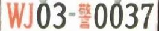
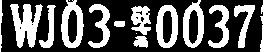
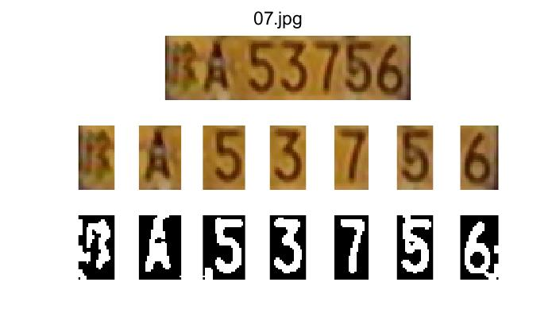

# 车牌定位与字符分割

<p style="text-align:center;">无76&emsp;RainEggplant&emsp;2017******</p>

## 原理与实现

本次实验的任务可以分为车牌定位和字符分割两个相对独立的部分，以下将分别进行介绍。

### 1. 车牌定位

在车牌定位部分，我们的工作流程如下图所示。

```flow
preprocess=>operation: 预处理
horizon=>operation: 提取粗边缘，估计水平线，并将图像旋转至水平
car=>operation: 提取水平和垂直方向的细边缘，估计汽车的大致范围
plate_rough=>operation: 利用形态学操作提取车牌的大致区域
plate_precise=>operation: 利用色彩与边缘信息提取车牌的精确位置

preprocess->horizon->car->plate_rough->plate_precise
```

#### 1.1 预处理

预处理包含对图像进行去噪、转换为灰度图和自适应直方图均衡化三个步骤。

由于摄像机采集到的图像含有噪声，其可能会对结果产生不良影响，因此需要进行去噪。但同时，由于边缘信息在车牌定位与字符分割中较为重要，因此不适合使用均值滤波器，故我们采用了 $3 \times 3$ 的中值滤波器。

通常情况下，由 RGB 图转换为灰度图是取三个通道的均值。但在本题目中，考虑到车牌颜色的特殊性，使用如下经验公式进行灰度化一般能取得更好的效果：
$$
gray = 0.229R+0.587G+0.114B
$$
为了增加图像的对比度，方便边缘的提取，我们采用了自适应的直方图均衡化，即限制对比度自适应直方图均衡化 (CLAHE)。

下图展示了预处理前后的对比图。

| 原图                             | 预处理后                                   |
| -------------------------------- | ------------------------------------------ |
|  |  |

本节对应的代码如下：

```matlab
img_denoised = med_filt_rgb(img);
img_gray = grayscale(img_denoised);
img_eq = adapthisteq(img_gray);
```

其中，`grayscale` 的定义为：

```matlab
function img_out = grayscale(img_in)
img_out = 0.229 * img_in(:, :, 1) + 0.587 * img_in(:, :, 2) + ...
    0.114 * img_in(:, :, 3);
end
```


#### 1.2 旋转图像至水平

由于拍摄角度问题，车身并不在图像的水平方向上（当然车牌也是），这会给我们之后定位车牌以及分割字符带来麻烦。理论上，将车身恢复水平需要经过透视变换，但因为透视变换的参数较难估计，而在本实验中旋转变换已经能起到很好的效果，其不准确度可以忽略不计，因此我们采用旋转变换来恢复水平。

在旋转前，我们需要首先估计真实水平线的角度。可以注意到，车身上存在着很多水平边缘，利用这些水平边缘，我们就可以估计水平线的角度。为了尽量排除其他边缘的影响，我们选择较大的阈值进行提取。这里我们采用 Canny 算子来提取边缘。注意图像的四周可能因为裁剪等原因而存在黑边，需要去除这些假边缘。

下图显示了上一节展示的图片的边缘提取效果。


可以看到提取出了很多车身上的水平边缘。我们接下来进行 Hough 变换提取直线，由于水平线数量占优，通过简单的阈值即可选出水平直线。此时，我们便可估计到水平线的角度。

获得水平线的角度后，我们旋转图像至水平，然后从中提取出含有有效像素的矩形区域。下图显示了旋转后的图像。


本节对应的代码如下：

```matlab
% 使用 canny 检测粗边缘，从中估计水平线的角度
threshold = [0.2 0.6];
img_edge = canny_no_border(img_eq, threshold);
[H, T, ~] = hough(img_edge);
theta_index = get_hline_theta_index(H);

% 将水平线旋转至水平
rot_angle = -sign(T(theta_index)) * (90 - abs(T(theta_index)));
img_eq_rot = rotate_image(img_eq, rot_angle);
```

其中，`canny_no_border` 去除了图像四边附近的边缘，其定义如下：

```matlab
function img_out = canny_no_border(img_out, threshold)
img_out = edge(img_out, 'Canny', threshold);
img_out(1:3, :) = 0;
img_out(end - 2:end, :) = 0;
img_out(:, 1:3) = 0;
img_out(:, end - 2:end) = 0;
end
```

`get_hline_theta_index` 的作用是通过阈值选出水平直线，其定义如下：

```matlab
function index = get_hline_theta_index(H)
H_max = max(H, [], 'all');
H_valid = H .* (H > 0.25 * H_max);
theta_hist = sum(H_valid, 1);
[val1, index1] = max(theta_hist(1:10));
[val2, index2] = max(theta_hist(end - 9:end));
if val1 > val2
    index = index1;
else
    index = length(theta_hist) - (10 - index2);
end
end
```

`rotate_image` 的作用是旋转图像并且仅选取含有有效像素的矩形区域，其定义如下，主要涉及一些数学运算：

```matlab
function img_out = rotate_image(img_in, rot_angle, method)
if nargin < 3
    method = 'bicubic';
end

height = size(img_in, 1);
width = size(img_in, 2);
img_rot = imrotate(img_in, rot_angle, method, 'crop');

alpha = atand(width / height);
half_diag = sqrt(width^2 + height^2) / 2;

rot_angle = abs(rot_angle);
w1 = half_diag * sind(alpha + rot_angle) - width / 2;
h1 = height / 2 - half_diag * cosd(alpha + rot_angle);
h_cut = ceil(h1 - w1 * tand(rot_angle));

h2 = half_diag * cosd(alpha - rot_angle) - height / 2;
w2 = width / 2 - half_diag * sind(alpha - rot_angle);
w_cut = ceil(w2 - h2 * tand(rot_angle));

img_out = img_rot(h_cut + 1:height - h_cut, w_cut + 1:width - w_cut, :);
end
```


#### 1.3 估计车身的大致范围

我们需要通过估计车身的大致范围，来达到两个目的。一是通过汽车所占区域的大小来估计后续操作的参数，实现一定的大小不变性；而是通过缩减车牌的定位区域来排除其他不相关因素的干扰。

我们可以注意到，车身相对背景通常可以提取出较多的边缘特征，而且大部分边缘都是水平或垂直方向，因此我们可以利用水平、垂直边缘来定位车身的范围。这里我们将阈值降低以提取更多的边缘。

下图展示了提取到的边缘和进行 Hough 变换后获得的水平与垂直方向的线段。

| 边缘                             | 水平、垂直线段                   |
| -------------------------------- | -------------------------------- |
|  |  |

只需要去除一些异常的线段，我们就可以定出车身的大致区域了。下图展示了最后获得的车身区域。


本节对应的代码如下：

```matlab
% 使用 canny 检测细边缘
threshold_detail = [0.1, 0.3];
img_edge_detail = canny_no_border(img_eq_rot, threshold_detail);

% 执行 Hough 变换，仅提取水平或垂直线
[H, T, R] = hough(img_edge_detail);
H_horizontal = get_H_valid(H, 1, 3);
H_vertical = get_H_valid(H, 91, 3);
v_lines = get_vertical_lines(img_edge_detail, H_vertical, T, R);
h_lines = get_horizontal_lines(img_edge_detail, H_horizontal, T, R);

% 利用提取到的水平、垂直线估计汽车所在的大致范围
rect_car = get_car_rect(h_lines, v_lines);
```

其中，`get_H_valid` 的作用是仅选出给定角度范围内的直线对应的 H，这里用来筛选水平和垂直线。其定义如下：

```matlab
function H_valid = get_H_valid(H, theta_index, offset)
n_index = size(H, 2);
H_valid = H;
index_r = theta_index + offset;
index_l = theta_index - offset;
if index_r >= n_index
    H_valid(:, mod(index_r, n_index) + 1:index_l - 1) = 0;
elseif index_l <= 1
    H_valid(:, index_r + 1:mod(index_l - 2, n_index) + 1) = 0;
else
    H_valid(:, 1:index_l - 1) = 0;
    H_valid(:, index_r + 1:end) = 0;
end
end
```

`get_vertical_lines` 和 `get_horizontal_lines` 的作用是结合图像，检测垂直线和水平线的端点。其定义如下：

```matlab
function lines = get_vertical_lines(img_edge, H_vertical, T, R)
scale = size(H_vertical, 1);
P_vertical = houghpeaks(H_vertical, 30, 'threshold', ceil(0.30 * max(H_vertical(:))));
lines = houghlines(img_edge, T, R, P_vertical, 'FillGap', ...
    scale / 250, 'MinLength', scale / 85);
end

function lines = get_horizontal_lines(img_edge, H_horizontal, T, R)
scale = size(H_horizontal, 1);
P_horizontal = houghpeaks(H_horizontal, 30, 'threshold', ceil(0.15 * max(H_horizontal(:))));
lines = houghlines(img_edge, T, R, P_horizontal, 'FillGap', ...
    scale / 190, 'MinLength', scale / 40);
end
```

`get_car_rect` 的作用是利用水平线和垂直线估计车身的大致区域，其定义如下：

```matlab
function rect = get_car_rect(h_lines, v_lines)
h_left = sort(arrayfun(@(x) min(x.point1(1), x.point2(1)), h_lines));
h_right = sort(arrayfun(@(x) max(x.point1(1), x.point2(1)), h_lines), 'descend');
h_top = sort(arrayfun(@(x) min(x.point1(2), x.point2(2)), h_lines));
h_bottom = sort(arrayfun(@(x) max(x.point1(2), x.point2(2)), h_lines), 'descend');
v_left = sort(arrayfun(@(x) min(x.point1(1), x.point2(1)), v_lines));
v_right = sort(arrayfun(@(x) max(x.point1(1), x.point2(1)), v_lines), 'descend');

if h_left(1) < v_left(1)
    if h_left(2) < v_left(1)  % --|
        left_most = h_left(2);
    else  % -|-
        left_most = min(h_left(2), v_left(2));
    end
else
    if h_left(1) < v_left(2)  % |-|
        left_most = min(h_left(2), v_left(2));
    else  % ||-
        left_most = min(h_left(1), v_left(3));
    end
end

if h_right(1) > v_right(1)
    if h_right(2) > v_right(1)
        right_most = h_right(2);
    else  % -|-
        right_most = max(h_right(2), v_right(2));
    end
else
    if h_right(1) > v_right(2)
        right_most = max(h_right(2), v_right(2));
    else  % ||-
        right_most = max(h_right(1), v_right(3));
    end
end

top_most = h_top(1);
bottom_most = h_bottom(1);

rect.point1 = [left_most, top_most];
rect.point2 = [right_most, bottom_most];
end
```


#### 1.4 形态学操作粗定位车牌

我们重新对车身区域进行自适应直方图均衡化，然后采用中等大小的阈值，再次提取边缘。下图展示了其中一幅边缘图像。


首先我们可以注意到，车牌部分由于字符的存在而有着非常丰富的边缘。同时，考虑到车牌为方形，因此我们可以采用方形的算子，连续进行闭运算和开运算，最终使字符扩充到车牌的整个区域。

下图展示了通过形态学操作获得的部分结果。

<table align="center" style="width: 90%;">
    <tr>
    	<td></td>
    	<td></td>
    </tr>
    <tr>
    	<td></td>
    	<td></td>
    </tr>
</table>

可以看到，通过形态学操作获得的车牌位置非常粗略，可能存在区域过大或过小的问题，并且还可能检测到非车牌的区域。这提示我们必须采用其他办法对车牌区域再进行精确的定位。

本节对应的代码如下：

```matlab
% 粗提取车牌 mask
car_edge_detail = edge(img_car_eq, 'Canny', [0.2 0.45]);
plate_mask = get_plate_mask(car_edge_detail);
```

其中 `get_plate_mask` 的定义如下：

```matlab
function mask = get_plate_mask(edge_car)
[height, width] = size(edge_car);

img_cl = imclose(edge_car, ones(round(height / 120), round(width / 40)));
img_op = imopen(img_cl, ones(round(height / 120), round(width / 40)));

img_cl = imclose(img_op, ones(round(height / 66), round(width / 22)));
img_op = imopen(img_cl, ones(round(height / 66), round(width / 22)));

img_cl = imclose(img_op, ones(round(height / 42), round(width / 14)));
img_op = imopen(img_cl, ones(round(height / 42), round(width / 14)));

img_op = imopen(img_op, ones(round(height / 24), round(width / 8)));
img_cl = imclose(img_op, ones(round(height / 24), round(width / 8)));

img_op = imopen(img_cl, ones(round(height / 18), round(width / 7)));
img_cl = imclose(img_op, ones(round(height / 18), round(width / 7)));

mask = img_cl;
end
```


#### 1.5 利用色彩与边缘信息精准定位车牌

我们注意到，在以上的所有操作中，我们并没有利用车牌的色彩信息，而事实上车牌的背景色是定位车牌的很好的线索。因此我们尝试利用色彩在粗定位的结果上重新划定区域。

我们略微扩大粗定位获得的选区，将选区对应的彩色图转换到 HSV 空间。在使用色彩进行定位时，我们一般会遇到如下两种情况：

1. 车牌底色为白色，或者出现过曝，使得图片中大部分像素的饱和度非常低
2. 车牌底色为彩色，饱和度较高，而色度分布较为集中

对于情况 1，我们以饱和度为优先条件进行筛选。我们首先在扩充前的选区中选出饱和度小于等于 0.05 的像素点，统计其亮度分布，然后选取 $s \le 0.05$, $v \in [\mu-2 \sigma,\mu+2 \sigma]$ 区间内的像素点，将其认为是车牌的背景。

对于情况 2，我们以色度为优先条件进行筛选。我们首先在扩充前的选区中统计饱和度大于 0.05 的像素的色度分布直方图，选取分布最多的一块作为色度的范围，然后统计该部分像素的亮度分布。然后选取  $s \gt 0.05$, $v \in [\mu-2 \sigma,\mu+2 \sigma]$, $h \in \{直方图中分布最多区域\}$ 区间内的像素点，将其认为是车牌的背景。

提取到这些背景点后，我们需要通过形态学操作将其连接起来。但经过试验发现，仅通过色彩定位仍然不够，因为有的车牌的边缘处会出现色偏等情况，导致提取到的区域缺失。因此，我们又在此基础上加入车牌的边缘信息，再次进行形态学操作。

最终，通过结合色彩与边缘信息，我们可以精准地定位车牌。下图显示了提取到的车牌结果。可以看到提取的区域非常准确。


本节对应的代码如下：

```matlab
% 拟合矩形，扩大选区，精准提取车牌区域
plate_boxes_rough = get_bounding_rects(plate_mask);
plate_boxes_ext = get_bounding_rects(plate_mask, [1.35, 1.15]);
for k = 1:length(plate_boxes_ext)
    % 粗提获得的彩色车牌图像
    img_plate_color_rough = ...
        img_car_color(plate_boxes_rough{k}.point1(2):plate_boxes_rough{k}.point2(2), ...
        plate_boxes_rough{k}.point1(1):plate_boxes_rough{k}.point2(1), :);

    % 扩大选区后的彩色车牌图像
    img_plate_color_ext = ...
        img_car_color(plate_boxes_ext{k}.point1(2):plate_boxes_ext{k}.point2(2), ...
        plate_boxes_ext{k}.point1(1):plate_boxes_ext{k}.point2(1), :);
    
    % 利用色彩与边缘信息提取精确的彩色车牌图像
    plate_rect = get_accurate_plate_rect(img_plate_color_rough, img_plate_color_ext);
```

其中，`get_bounding_rects` 的作用是提取 mask 的外接矩形，并且可以指定是否扩展选区。其定义如下：

```matlab
function rects = get_bounding_rects(mask, extend_factors)
if nargin < 2
    extend_factors = [1, 1];
end

[height, width] = size(mask);
stats = regionprops(mask, 'BoundingBox');
boxes = {stats.BoundingBox};

rects = {};

for k = 1:length(boxes)  
    rects{k}.point1 = ...
        [max(round(boxes{k}(1) + 0.5 * boxes{k}(3) * (1 - extend_factors(1))), 1), ...
         max(round(boxes{k}(2) + 0.5 * boxes{k}(4) * (1 - extend_factors(2))), 1)];
     
    rects{k}.point2 = ...
        [min(round(boxes{k}(1) + 0.5 * boxes{k}(3) * (1 + extend_factors(1))), width), ...
         min(round(boxes{k}(2) + 0.5 * boxes{k}(4) * (1 + extend_factors(2))), height)];
    
end
end
```

`get_accurate_plate_rect` 的作用是在粗定位的基础上，结合色彩和边缘信息精确定位车牌的位置。其定义如下：

```matlab
function rect = get_accurate_plate_rect(img_plate_color_rough, img_plate_color_ext)
height = size(img_plate_color_ext, 1);
width = size(img_plate_color_ext, 2);
[h, s, v] = rgb2hsv(img_plate_color_rough);
    
if sum(s <= 0.05, 'all') > 0.35 * numel(s)
    % 认为车牌背景为白色或者出现了过曝
    % 以饱和度为优先条件进行筛选
    vv = v(s <= 0.05);
    v_range = [mean(vv) - 2 * std(vv), mean(vv) + 2 * std(vv)];
    img_filt = in_range(rgb2hsv(img_plate_color_ext), [0, 0, v_range(1)], [1, 0.05, v_range(2)]);
else
    % 彩色主导，因此以色度为优先条件进行筛选
    hh = h(s > 0.05);
    f = figure('visible','off');
    hist_h = histogram(hh(:), [0:1/24:1]);
    [~, index] = max(hist_h.BinCounts);
    close(f);
    h_range = [(index - 1) / 24, index / 24];
    vv = v(s > 0.05 & h > h_range(1) & h < h_range(2));
    v_range = [mean(vv) - 2 * std(vv), mean(vv) + 2 * std(vv)];
    img_filt = in_range(rgb2hsv(img_plate_color_ext), [h_range(1), 0.05, v_range(1)], [h_range(2), 1, v_range(2)]);
end

% 粗提取车牌的大致区域
img_op = imopen(img_filt, [1 1]);

img_cl = imclose(img_op, ones(round(height / 4), round(width / 8)));
img_op = imopen(img_cl, ones(round(height / 4), round(width / 8)));

img_cl = imclose(img_op, ones(round(height / 3), round(width / 6)));
img_op = imopen(img_cl, ones(round(height / 3), round(width / 6)));

% 扩大以上获得的选区
boxes = get_bounding_rects(img_op, [1.15, 1.02]);
box_id = get_max_area_rect_id(boxes, 2.5);

if box_id == 0
    rect.point1 = [-1, -1];
    return;
end

% 加入选区内的边缘信息
im_gray = adapthisteq(grayscale(img_plate_color_ext));
im_edge = edge(im_gray, 'Canny', [0.4 0.7]);
im_valid_edge = zeros(height, width);
im_valid_edge(boxes{box_id}.point1(2):boxes{box_id}.point2(2), ...
    boxes{box_id}.point1(1):boxes{box_id}.point2(1)) = 1;
im_valid_edge = im_valid_edge & im_edge;

% 精提取车牌区域
img_op = img_filt | im_valid_edge;
img_op = imopen(img_op, [1 1]);

img_cl = imclose(img_op, ones(round(height / 4), round(width / 8)));
img_op = imopen(img_cl, ones(round(height / 4), round(width / 8)));

img_cl = imclose(img_op, ones(round(height / 3), round(width / 6)));
img_op = imopen(img_cl, ones(round(height / 3), round(width / 6)));

acc_plate_boxes = get_bounding_rects(img_op, [1.01, 1.02]);
box_id = get_max_area_rect_id(acc_plate_boxes, 2.5);

if box_id == 0
    rect.point1 = [-1, -1];
    return;
end

rect = acc_plate_boxes{box_id};
end
```

`in_range` 是我们定义的一个辅助逻辑运算函数，其作用类似 OpenCV 中的 `inRange` 函数，可以获取在给定区间内的像素的 mask。其定义如下：

```matlab
function mask = in_range(img, lower, upper)
% lower: Define three element vector here for each colour plane i.e. [0 128 128];
% upper: Define three element vector here for each colour plane i.e. [0 128 128];

mask = true(size(img, 1), size(img, 2));
for p = 1 : 3
    mask = mask & (img(:, :, p) >= lower(p) & img(:, :, p) <= upper(p));
end
end
```

至此，我们已基本完成了车牌的定位工作（还存在排除非车牌结果要做，但因为这部分是语义相关的，我们放在下一节进行筛选）。


### 2 字符分割

在字符分割部分，我们的工作流程如下图所示。

```flow
preprocess=>operation: 预处理
projection=>operation: 基于灰度投影进行分割
con_comp=>operation: 基于连通域对灰度投影失效的字符进行分割

preprocess->projection->con_comp
```

#### 2.1 预处理

字符分割部分的输入即上一节的输出——车牌的彩色图。因此预处理包含转换为灰度图、自适应直方图均衡化、二值化三个步骤。其中灰度化、自适应直方图均衡化同前。

在进行二值化时，我们还需要识别图像的极性，即字符的颜色为白色还是黑色。这里我们统一将字符转化为白色。下图展示了两组车牌进行预处理后的结果。

| 原图                           | 预处理后                               |
| ------------------------------ | -------------------------------------- |
|  |  |
|  |  |

可以看到无论车牌背景是深色还是浅色，二值化后字符始终为白色。

本节对应的代码如下：

```matlab
img_gray = grayscale(img_plate);
img_eq = adapthisteq(img_gray, 'NumTiles', [4, 6]);
img_bin = imbinarize(img_eq);
polarity = detect_polarity(img_bin);
img_bin = xor(img_bin, polarity);
```

其中，`detect_polarity` 的原理是抹去面积小于阈值后的连通域后，比较所有像素中 0 与 1 之比。其定义如下：

```matlab
function polarity = detect_polarity(BW)
% polarity: 0 - foreground is logical 1; 1 - foreground is logical 0;
BW = medfilt2(BW, [3, 3]);
n_pixel_threshold = round(numel(BW) * 0.08);
BW_background = bwareaopen(BW, n_pixel_threshold);
if sum(BW_background == 0, 'all') > 5 * sum(BW_background == 1, 'all')
    polarity = 0;
    return;
end

BW_background = bwareaopen(~BW, n_pixel_threshold);
if sum(BW_background == 0, 'all') > 5 * sum(BW_background == 1, 'all')
    polarity = 1;
    return;
end

polarity = (sum(BW == 0, 'all') < sum(BW == 1, 'all'));
end
```


#### 2.2 基于灰度投影进行分割

本节可以分为优化二值化图像与筛选、计算灰度投影并平滑和利用灰度投影进行分割三个小节。下面将逐一介绍。

##### 2.2.1 优化二值化图像与筛选

上一节获得的二值化图像中可能还存在噪点、边缘线等影响灰度投影的因素，因此需要对图像进行优化。我们采用了结合连通域面积、中值滤波和开运算的方法，同时又使用 y 方向的投影来去除水平边缘线。

下图展示了优化效果，可以看到，水平边缘线和图中的一些噪点已被去掉。

| 优化前                                     | 优化后                             |
| ------------------------------------------ | ---------------------------------- |
|  |  |

我们采用了一种简单的办法来筛选出车牌和非车牌，即取若干条 x 方向的直线，统计其灰度跳变数。若超过阈值则不是车牌。

本节对应的代码如下：

```matlab
area_threshold = round(numel(BW) * 0.004);
img = bwareaopen(BW, area_threshold);
img = medfilt2(img, [3, 3]);
img_characters = img;
img = imopen(img, ones(2, 2));

if ~check_validity(img)
    x_ranges = {};
    y_range = [];
    return;
end

y_range = get_y_range(img);
img_cut = img(y_range(1):y_range(2), :);
```

其中，`check_validity` 的作用是检测是否是有效车牌，其定义如下：

```matlab
function is_valid = check_validity(BW)
[height, width] = size(BW);
y_scan = [round(height * 0.3), round(height * 0.5), round(height * 0.7)];
x_start = round(width * 0.1);
status = [BW(y_scan(1), x_start), BW(y_scan(2), x_start), BW(y_scan(3), x_start)];
n_flip = [0, 0, 0];
for x = x_start:round(width * 0.9)
    for y = 1:length(y_scan)
        if BW(y_scan(y), x) ~= status(y)
            status(y) = BW(y_scan(y), x);
            n_flip(y) = n_flip(y) + 1;
        end
    end
end

is_valid = all(n_flip < 30); 
end
```

`get_y_range` 的作用是使用 y 方向的投影来获取真正有用的 y 轴范围。其定义如下：

```matlab
function range = get_y_range(BW)
[height, width] = size(BW);
upper_part = BW(1:round(height * 0.15), :);
lower_part = BW(round(height * 0.85):end, :);

upper_proj = sum(upper_part, 2);
lower_proj = sum(lower_part, 2);

y_upper_candidate = find(upper_proj < max(upper_proj) * 0.16);
if isempty(y_upper_candidate)
    y_upper = 1;
else
    y_upper = max(y_upper_candidate);
end

y_lower_candidate = find(lower_proj < max(lower_proj) * 0.16);
if isempty(y_lower_candidate)
    y_lower = height;
else
    y_lower = min(y_lower_candidate) + round(height * 0.85) - 1;
end

range = [y_upper, y_lower];
end
```


##### 2.2.2 计算灰度投影并平滑

此时我们即可计算灰度投影，但如果只是单纯计数累加，则会存在一定的问题。例如，车牌顶部和底部仍可能存在边缘干扰结果，分布在车牌中部但面积小的字符（如警车中的 “-”）不容易被检测。因此，我们设置一个高斯权重，求取加权和。

另外一个问题是灰度投影中可能出现毛刺，导致按照阈值分割时出现连续的小的区间。因此，这还要求我们进行平滑处理。

下图展示了平滑处理前后的结果。可以看到，通过平滑处理可以避免错误的分段。

| 处理前                                                     | 处理后                                             |
| ---------------------------------------------------------- | -------------------------------------------------- |
|  |  |

本节对应的代码如下：

```matlab
projection = calc_projection(img_cut);
```

其中，`calc_projection` 的定义为：

```matlab
function projection = calc_projection(BW)
[height, width] = size(BW);
weight = normpdf([1:height], (1 + height) / 2, height / 6);
sum_along_x = zeros(1, width);
for x = 1:width
    sum_along_x(x) = weight * BW(:, x);
end

projection = smooth_lower_data(sum_along_x, [0.06, 0.08]);
end
```

用到的平滑函数 `smooth_lower_data` 的定义为：

```matlab
function data = smooth_lower_data(data, threshold)
% threshold [low, high]
%   low - 触发 smooth 操作尝试的起始上升点的最大值
%   high - 使 smooth 操作有效的峰值的最大值
rise_start_pos = 0;
is_tracking = 0;
is_searching = 0;  % whether is looking for the second rising edge

for x = 2:length(data)
    derivate = sign(data(x) - data(x - 1));
    if is_searching
        if derivate > 0
            % got the second rising edge, do linear interpolation
            start_val = data(rise_start_pos);
            data(rise_start_pos:x - 1) = linspace(start_val, data(x - 1), x - rise_start_pos);
            is_searching = 0;
            if data(x - 1) < start_val
                rise_start_pos = x - 1;
            end
            if data(x) >= threshold(1)
                is_tracking = 0;
            end
        end
    else
        if ~is_tracking && derivate > 0 && data(x - 1) < threshold(1) && data(x) <= threshold(2)
            % got the first rising edge
            rise_start_pos = x - 1;
            is_tracking = 1;
        elseif is_tracking
            if derivate > 0 && data(x) > threshold(2)
                is_tracking = 0;
            elseif derivate < 0
                is_searching = 1;
            end
        end
    end
end

if is_searching
    % 平滑尾段
    data(rise_start_pos:x) = linspace(data(rise_start_pos), data(x), x - rise_start_pos + 1);
end
end
```


##### 2.2.3 利用灰度投影进行分割

该方法的基本思想是通过不断提高投影值的阈值，检测被阈值切断的区间数，当达到一定的区间数后停止。不过，该方法也涉及到很多细节。例如需要忽略竖直方向的车牌边缘、忽略过于接近的区间等。

提取到区间后，需要从区间生成切割的 x 坐标。我们选择的是区间中最小值对应的位置（如果出现连续最小值，则为其中间的位置）。

本节的代码如下：

```matlab
function seg_pos = split_character_projection(projection)
len = length(projection);
character_len = 0.055 * len;
threshold = 0;

while 1
    sections = get_sections(projection, threshold);
    if length(sections) >= 6
        seg_pos = [];

        if sections{1}(1) > character_len
            seg_pos(end + 1) = 1;
        end

        for sec_id = 2:length(sections)
            if min_middle(sections{sec_id}) - min_middle(sections{sec_id - 1}) > character_len
                seg_pos(end + 1) = min_middle(sections{sec_id - 1});
            end
        end

        seg_pos(end + 1) = min_middle(sections{sec_id});

        if len - sections{end}(2) + 1 > character_len
            seg_pos(end + 1) = len;
        end

        if length(seg_pos) >= 8
            break;
        end   
    end
    
    threshold = threshold + 0.005;
    if threshold > 0.2
        break;
    end
end

seg_pos = round(seg_pos);

    function pos_mid = min_middle(section)
        [val, pos] = min(projection(section(1):section(2)));
        pos = section(1) + pos - 1;
        pos_right = pos + 1;
        while pos_right < section(2) && projection(pos_right) == val
            pos_right = pos_right + 1;
        end
        pos_right = pos_right - 1;
        pos_mid = round((pos + pos_right) / 2);
    end
end

function sections = get_sections(data, threshold)
sections = {};
len = length(data);

start_pos = 0;
for x = 1:len
    if start_pos == 0 && data(x) <= threshold
        start_pos = x;
    elseif start_pos ~= 0 && data(x) > threshold
        sections{end + 1} = [start_pos, x - 1];
        start_pos = 0;
    end
end

if start_pos ~= 0
    sections{end + 1} = [start_pos, x];
end
end
```


#### 2.3 基于连通域再次分割

至此我们已经基本完成了字符分割。但是对于下图这种存在重叠的字符，灰度投影法无法将其分开。因此我们考虑采用基于连通域的方法再次进行分割。


我们可以首先统计基于灰度投影分割后的字符的宽度的中位数，如果有字符宽度超出中位数很多，则证明其有异常，需要采用基于连通域的方法再次分割。

在使用连通域分割时，我们求每一个连同域的外接矩形，如果其宽度大于阈值，则作为一个字符分割开来。

本节对应的代码如下：

```matlab
ch_width = seg_pos(2:end) - seg_pos(1:end - 1);
ch_width_median = median(ch_width);

x_ranges = {};
for n = 1:length(ch_width)
    if ch_width(n) > 1.6 * ch_width_median
        x_seg = split_character_cc(img_cut(:, seg_pos(n):seg_pos(n + 1)), 0.5 * ch_width_median);
        if isempty(x_seg)
            x_ranges{end + 1} = [seg_pos(n), seg_pos(n + 1)];
        else
            for k = 1:length(x_seg)
                x_ranges{end + 1} = [x_seg{k}(1), x_seg{k}(2)] + seg_pos(n) - 1;
            end
        end
    else
        x_ranges{end + 1} = [seg_pos(n), seg_pos(n + 1)];
    end
end
end
```

其中，`split_character_cc` 的定义如下：

```matlab
function x_seg = split_character_cc(BW, threshold_width)
x_seg = {};
stats = regionprops(BW, 'BoundingBox');
for n = 1:length(stats)
    if stats(n).BoundingBox(3)< threshold_width
        continue;
    end
    x_seg{end + 1} = round([stats(n).BoundingBox(1), stats(n).BoundingBox(1) + stats(n).BoundingBox(3) - 1]);
end
end
```

至此，我们就完成了全部的分割任务。


## 实验结果

### 车牌图片与分割结果





### 车牌 mask

请见 `results/mask` 文件夹下。


## 附录

提交代码文件清单：

```
.
│  extract_plate_and_characters.m
│  main.m
│
└─utilities
    │  in_range.m
    │
    ├─detection
    │      check_validity.m
    │      detect_polarity.m
    │      generate_global_mask.m
    │      get_accurate_plate_rect.m
    │      get_bounding_rects.m
    │      get_car_rect.m
    │      get_max_area_rect_id.m
    │      get_plate_mask.m
    │
    ├─orientation
    │      get_hline_theta_index.m
    │      get_horizontal_lines.m
    │      get_H_valid.m
    │      get_vertical_lines.m
    │
    ├─segmentation
    │      calc_projection.m
    │      get_character_pos.m
    │      get_y_range.m
    │      refine_character_image.m
    │      smooth_lower_data.m
    │      split_character.m
    │      split_character_cc.m
    │      split_character_projection.m
    │
    └─transformation
            canny_no_border.m
            grayscale.m
            med_filt_rgb.m
            rotate_image.m
```

